# Architecture Diagram

## Overview

ScheduleSystem follows an ASP.NET Core MVC architecture with a service layer and Entity Framework Core for database access.

The application is divided into several logical layers:

```text
User Interface
      │
      ▼
ASP.NET Core MVC
      │
      ├── Controllers
      ├── ViewModels
      └── Razor Views
      │
      ▼
Application Services
      │
      ├── ScheduleValidationService
      ├── ScheduleGeneratorService
      ├── ClassroomRecommendationService
      └── ScheduleExportService
      │
      ▼
Data Access
      │
      ├── ApplicationDbContext
      ├── Entity Framework Core
      └── Npgsql
      │
      ▼
PostgreSQL
```

## Full Architecture Diagram

```mermaid
flowchart TB

    User["User / Administrator"]

    subgraph Presentation["Presentation Layer"]
        Layout["Shared Layout"]
        Views["Razor Views"]
        ViewModels["ViewModels"]
    end

    subgraph MVC["ASP.NET Core MVC"]
        Controllers["Controllers"]

        AccountController["AccountController"]
        HomeController["HomeController"]
        SchedulesController["SchedulesController"]
        ScheduleGeneratorController["ScheduleGeneratorController"]
        TeachersController["TeachersController"]
        GroupsController["GroupsController"]
        SubjectsController["SubjectsController"]
        ClassroomsController["ClassroomsController"]
        NotificationsController["NotificationsController"]
        AuditLogsController["AuditLogsController"]
        AnalyticsController["AnalyticsController"]
    end

    subgraph Services["Application Services"]
        Validation["ScheduleValidationService"]
        Generator["ScheduleGeneratorService"]
        Recommendations["ClassroomRecommendationService"]
        Export["ScheduleExportService"]
    end

    subgraph Data["Data Access Layer"]
        DbContext["ApplicationDbContext"]
        EF["Entity Framework Core"]
        Npgsql["Npgsql Provider"]
    end

    subgraph Database["PostgreSQL Database"]
        Identity["ASP.NET Core Identity"]
        Teachers["Teachers"]
        Subjects["Subjects"]
        TeacherSubjects["TeacherSubjects"]
        Groups["Groups"]
        Classrooms["Classrooms"]
        Categories["ClassroomCategories"]
        Schedules["Schedules"]
        TimeSlots["ScheduleTimeSlots"]
        Settings["ScheduleGenerationSettings"]
        Notifications["Notifications"]
        AuditLogs["AuditLogs"]
    end

    User --> Layout
    Layout --> Views
    Views --> Controllers
    ViewModels --> Controllers

    Controllers --> AccountController
    Controllers --> HomeController
    Controllers --> SchedulesController
    Controllers --> ScheduleGeneratorController
    Controllers --> TeachersController
    Controllers --> GroupsController
    Controllers --> SubjectsController
    Controllers --> ClassroomsController
    Controllers --> NotificationsController
    Controllers --> AuditLogsController
    Controllers --> AnalyticsController

    SchedulesController --> Validation
    SchedulesController --> Recommendations
    ScheduleGeneratorController --> Generator
    ScheduleGeneratorController --> Validation
    ClassroomsController --> Recommendations
    SchedulesController --> Export

    AccountController --> DbContext
    HomeController --> DbContext
    TeachersController --> DbContext
    GroupsController --> DbContext
    SubjectsController --> DbContext
    ClassroomsController --> DbContext
    NotificationsController --> DbContext
    AuditLogsController --> DbContext
    AnalyticsController --> DbContext

    Validation --> DbContext
    Generator --> DbContext
    Recommendations --> DbContext
    Export --> DbContext

    DbContext --> EF
    EF --> Npgsql
    Npgsql --> Identity
    Npgsql --> Teachers
    Npgsql --> Subjects
    Npgsql --> TeacherSubjects
    Npgsql --> Groups
    Npgsql --> Classrooms
    Npgsql --> Categories
    Npgsql --> Schedules
    Npgsql --> TimeSlots
    Npgsql --> Settings
    Npgsql --> Notifications
    Npgsql --> AuditLogs
```



## Layer Responsibilities

### 1. Presentation Layer

The presentation layer is responsible for displaying information to users.

Main components:

* Razor Views
* Shared Layout
* ViewModels
* CSS
* JavaScript

The presentation layer does not directly access the PostgreSQL database.

### 2. Controllers

Controllers process HTTP requests and coordinate application operations.

Main controllers include:

| Controller                    | Responsibility                |
| ----------------------------- | ----------------------------- |
| `HomeController`              | Dashboard and main page       |
| `SchedulesController`         | Schedule management           |
| `ScheduleGeneratorController` | Automatic schedule generation |
| `TeachersController`          | Teacher management            |
| `GroupsController`            | Group management              |
| `SubjectsController`          | Subject management            |
| `ClassroomsController`        | Classroom management          |
| `NotificationsController`     | Notifications                 |
| `AuditLogsController`         | Audit history                 |
| `AnalyticsController`         | Statistics and analytics      |
| `AccountController`           | Account-related operations    |

Controllers are responsible for coordinating requests rather than implementing complex business algorithms.

## 3. Application Services

Complex business logic is separated from controllers.

### ScheduleValidationService

Responsible for detecting schedule conflicts.

It checks conditions such as:

```text
Teacher conflict
       │
       ├── Same teacher
       └── Overlapping time

Group conflict
       │
       ├── Same group
       └── Overlapping time

Classroom conflict
       │
       ├── Same classroom
       └── Overlapping time
```

It also validates time intervals and schedule constraints.

### ScheduleGeneratorService

Responsible for automatic schedule generation.

The generator considers:

* groups;
* subjects;
* teachers;
* teacher-subject assignments;
* classrooms;
* classroom categories;
* classroom capacity;
* weekly lesson requirements;
* daily lesson limits;
* teaching days;
* gaps.

Simplified flow:

```text
Groups
   │
   ▼
Subjects
   │
   ▼
Available Teachers
   │
   ▼
Available Classrooms
   │
   ▼
Constraint Checking
   │
   ▼
Generated Schedule
```

### ClassroomRecommendationService

Finds suitable classrooms for a group and subject.

The recommendation process considers:

```text
Subject requirements
        │
        ▼
Classroom category
        │
        ▼
Classroom capacity
        │
        ▼
Available classrooms
```

A classroom must satisfy the required category and have sufficient capacity for the group.

### ScheduleExportService

Provides schedule export functionality.

Supported formats:

* PDF
* Excel
* CSV

```text
Schedule
    │
    ▼
ScheduleExportService
    │
    ├── PDF
    ├── Excel
    └── CSV
```

## 4. Data Access Layer

The main data access component is:

```text
ApplicationDbContext
```

It inherits from Entity Framework Core Identity's `IdentityDbContext<ApplicationUser>`.

The context contains `DbSet` collections for the main application entities.

```text
ApplicationDbContext
       │
       ├── Teachers
       ├── Subjects
       ├── TeacherSubjects
       ├── Groups
       ├── Classrooms
       ├── ClassroomCategories
       ├── Schedules
       ├── ScheduleTimeSlots
       ├── ScheduleGenerationSettings
       ├── Notifications
       └── AuditLogs
```

## 5. Database Layer

The application uses:

```text
PostgreSQL
```

with:

```text
Entity Framework Core
        │
        ▼
Npgsql
        │
        ▼
PostgreSQL
```

The database stores both application data and ASP.NET Core Identity data.

## Request Lifecycle

A typical request follows this path:

```text
Browser
   │
   │ HTTP Request
   ▼
Controller
   │
   ▼
Service
   │
   ▼
ApplicationDbContext
   │
   ▼
Entity Framework Core
   │
   ▼
Npgsql
   │
   ▼
PostgreSQL
   │
   │ Query Result
   ▼
ApplicationDbContext
   │
   ▼
Service
   │
   ▼
Controller
   │
   ▼
Razor View
   │
   ▼
Browser
```

## Schedule Creation Flow

```text
User opens Create Schedule
            │
            ▼
     Selects group
            │
            ▼
     Selects subject
            │
            ▼
     Selects teacher
            │
            ▼
     Selects classroom
            │
            ▼
     Selects date/time
            │
            ▼
 ScheduleValidationService
            │
       ┌────┴────┐
       │         │
      Valid    Conflict
       │         │
       ▼         ▼
    Save      Error
       │
       ▼
   PostgreSQL
```

## Automatic Generation Flow

```text
Generation Settings
        │
        ▼
ScheduleGeneratorService
        │
        ├── Groups
        ├── Subjects
        ├── Teachers
        ├── TeacherSubject
        ├── Classrooms
        └── Classroom Categories
        │
        ▼
Constraint Processing
        │
        ▼
ScheduleValidationService
        │
        ▼
Valid Schedule
        │
        ▼
PostgreSQL
```

## Authentication Flow

ASP.NET Core Identity is responsible for authentication and authorization.

```text
User
 │
 ▼
Login
 │
 ▼
ASP.NET Core Identity
 │
 ├── Authentication
 ├── Password validation
 └── Role validation
 │
 ▼
Authorized Controller
 │
 ▼
Application
```

The application supports administrator and regular user roles.

## Teacher-Subject Architecture

The relationship between teachers and subjects is implemented using an explicit join entity:

```text
┌──────────┐
│ Teacher  │
└────┬─────┘
     │
     │ 1..*
     ▼
┌────────────────┐
│ TeacherSubject │
└───────┬────────┘
        │
        │ *..1
        ▼
┌──────────┐
│ Subject  │
└──────────┘
```

This allows:

* one teacher to teach multiple subjects;
* one subject to have multiple teachers;
* schedule validation to use the actual teacher-subject assignments;
* automatic generation to select appropriate teachers.

## Dependency Injection

Application services are registered through ASP.NET Core dependency injection.

Conceptually:

```text
Controller
    │
    ▼
Injected Service
    │
    ▼
ApplicationDbContext
```

This keeps dependencies explicit and makes the application easier to maintain and test.

## Configuration

Application configuration is separated from application code.

Important configuration includes:

* PostgreSQL connection string;
* administrator password;
* ASP.NET Core environment;
* Identity settings.

Sensitive values should be provided through environment variables or secure configuration.

Example:

```text
Admin__Password
```

## Security Architecture

Security is provided by several layers:

```text
Authentication
      │
      ▼
Authorization
      │
      ▼
Role Checks
      │
      ▼
Controller Validation
      │
      ▼
Business Validation
      │
      ▼
Database Constraints
```

The administrator password is not stored directly in source code.

## Architecture Principles

The project follows several important principles:

### Separation of Responsibilities

Each component has a specific role.

```text
Controller
   ↓
Coordinates

Service
   ↓
Business Logic

DbContext
   ↓
Data Access

Database
   ↓
Persistent Storage
```

### Reusable Business Logic

Schedule validation, generation, classroom recommendations, and exports are implemented as separate services.

### Database Abstraction

Controllers and services work through Entity Framework Core rather than directly executing database-specific operations wherever possible.

### Maintainability

The architecture makes it possible to modify one part of the system without rewriting unrelated components.

## Project Structure

```text
ScheduleSystem/
│
├── Controllers/
│
├── Data/
│
├── Models/
│
├── Services/
│
├── ViewComponents/
│
├── ViewModels/
│
├── Views/
│
├── wwwroot/
│   ├── css/
│   ├── js/
│   └── ...
│
├── Migrations/
│
├── docs/
│
├── Program.cs
├── appsettings.json
└── ScheduleSystem.csproj
```

## Architecture Summary

The overall architecture can be summarized as:

```text
                 ┌──────────────────┐
                 │      Browser     │
                 └────────┬─────────┘
                          │
                          ▼
                 ┌──────────────────┐
                 │   Razor / MVC    │
                 │   Controllers    │
                 └────────┬─────────┘
                          │
                          ▼
              ┌─────────────────────────┐
              │   Application Services  │
              │                         │
              │ Validation              │
              │ Generation              │
              │ Recommendations         │
              │ Export                  │
              └────────────┬────────────┘
                           │
                           ▼
                 ┌──────────────────┐
                 │ ApplicationDbCtx │
                 │   EF Core        │
                 └────────┬─────────┘
                          │
                          ▼
                 ┌──────────────────┐
                 │    PostgreSQL    │
                 └──────────────────┘
```

This architecture provides a clear separation between the user interface, request processing, business logic, data access, and persistent storage.
