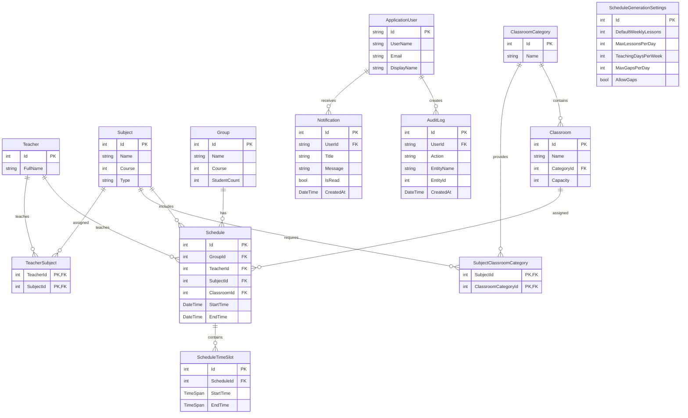

# Database ER Diagram

## Overview

ScheduleSystem uses PostgreSQL with Entity Framework Core Code First.

The database contains entities for users, teachers, subjects, groups, classrooms, schedules, notifications, audit logs, and automatic schedule generation.

## Entity Relationship Diagram



## Main Relationships

### Teacher ↔ Subject

Teachers and subjects have a many-to-many relationship through `TeacherSubject`.

One teacher can teach multiple subjects, and one subject can be taught by multiple teachers.

```text
Teacher
   │
   └── TeacherSubject ── Subject
```

The composite primary key is:

```text
(TeacherId, SubjectId)
```

### Subject ↔ ClassroomCategory

Subjects can require one or more classroom categories.

For example:

```text
Computer Graphics
        │
        └── Computer Classroom
```

The relationship is implemented through `SubjectClassroomCategory`.

### ClassroomCategory → Classroom

Each classroom belongs to a classroom category.

```text
ClassroomCategory
        │
        └── Classroom
```

The category determines the type of room, while `Capacity` determines whether the room can accommodate a group.

### Group → Schedule

A group can have multiple schedule entries.

```text
Group
  │
  └── Schedule
```

Each schedule entry connects a group with a teacher, subject, and classroom.

### Teacher → Schedule

A teacher can have multiple schedule entries.

The scheduling and validation services use this relationship to detect teacher conflicts.

### Subject → Schedule

Each schedule entry represents a particular subject being taught.

### Classroom → Schedule

A classroom can be assigned to multiple schedule entries at different times.

The schedule validation service prevents conflicting assignments.

### Schedule → ScheduleTimeSlot

A schedule can contain one or more time slots.

Time slots store the detailed time information used by the scheduling system.

### ApplicationUser → Notification

Users can receive notifications related to changes or important schedule information.

### ApplicationUser → AuditLog

User actions can be recorded in the audit log.

This provides a history of important operations performed in the system.

## Simplified Database Structure

```text
                    ┌─────────────────┐
                    │ ApplicationUser  │
                    └───────┬─────────┘
                            │
                  ┌─────────┴─────────┐
                  ▼                   ▼
           ┌─────────────┐     ┌─────────────┐
           │ Notification│     │  AuditLog   │
           └─────────────┘     └─────────────┘


┌──────────┐       ┌────────────────┐       ┌───────────┐
│ Teacher  │──────▶│ TeacherSubject │◀──────│  Subject  │
└────┬─────┘       └────────────────┘       └─────┬─────┘
     │                                             │
     │                                             │
     │                                      ┌──────▼──────────────┐
     │                                      │SubjectClassroom      │
     │                                      │Category              │
     │                                      └──────┬──────────────┘
     │                                             │
     ▼                                             ▼
┌──────────┐                                ┌─────────────────┐
│ Schedule │───────────────────────────────▶│ClassroomCategory│
└────┬─────┘                                └────────┬────────┘
     │                                               │
     │                                               ▼
     │                                       ┌─────────────┐
     │                                       │  Classroom  │
     │                                       └─────────────┘
     │
     ├──────────────▶ Group
     │
     ├──────────────▶ Teacher
     │
     ├──────────────▶ Subject
     │
     └──────────────▶ Classroom
             │
             ▼
      ScheduleTimeSlot
```

## Schedule Generation

`ScheduleGenerationSettings` contains the configuration used by the automatic schedule generator.

Default parameters:

| Parameter               | Default value |
| ----------------------- | ------------: |
| Lessons per week        |             3 |
| Maximum lessons per day |             4 |
| Teaching days per week  |             5 |
| Maximum gaps per day    |             2 |
| Allow gaps              |           Yes |

The generator uses existing teachers, subjects, groups, classrooms, classroom categories, and their relationships to construct a valid schedule.

## Data Integrity

The database uses:

* Primary keys for entity identification.
* Foreign keys for relationships.
* Composite primary keys for many-to-many relationships.
* Entity Framework Core migrations for schema versioning.
* PostgreSQL constraints for referential integrity.

The most important many-to-many relationship is:

```text
Teacher
   │
   ├── TeacherSubject
   │
   └── Subject
```

This allows the system to correctly represent teachers who teach multiple subjects.

## Database Technology

```text
Application
     │
     ▼
ASP.NET Core MVC
     │
     ▼
Entity Framework Core
     │
     ▼
Npgsql
     │
     ▼
PostgreSQL
```

Database name:

```text
schedulesystem
```

## Related Documentation

* `TechnicalDocumentation.md` — technical documentation
* `Architecture.md` — application architecture
* `Deployment.md` — deployment instructions
* `AdminGuide.md` — administrator guide
* `UserGuide.md` — user guide
